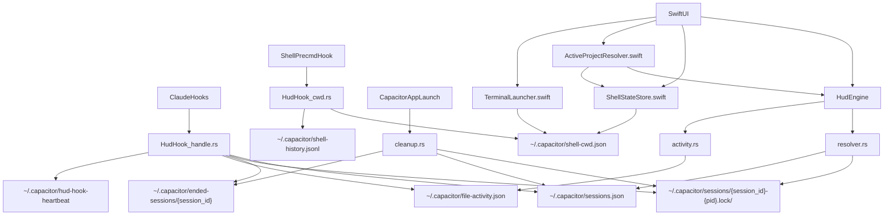
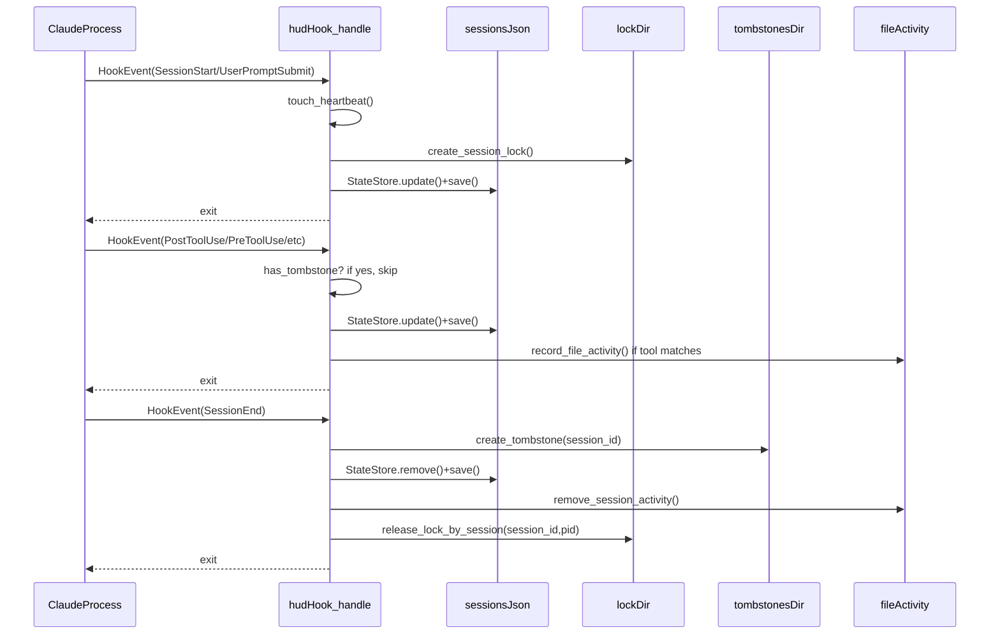
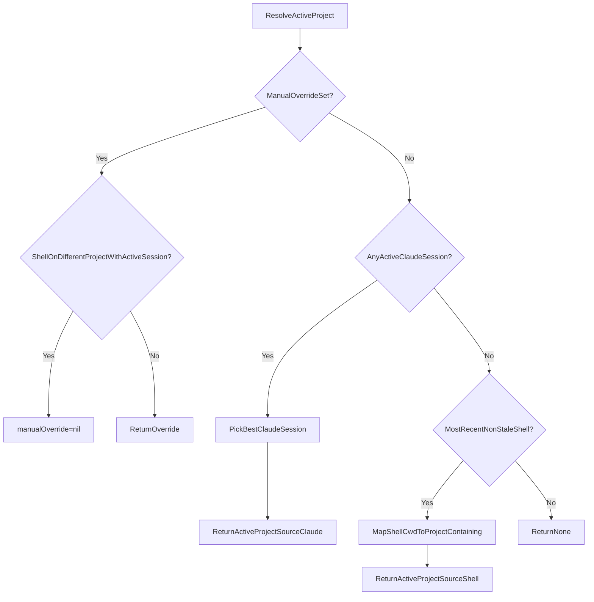
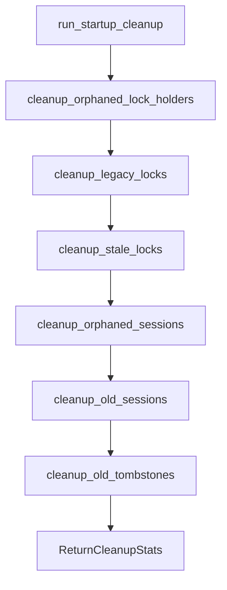

# Current System Map (Ground Truth)

This document is the **canonical map** of Capacitor’s state detection + activation systems **as implemented today**.

It is written to prevent regressions caused by “fixing the visible symptom” in one subsystem while violating assumptions in another.

## What this covers

- **Session state detection** (Claude hooks + locks + records + activity fallback)
- **Active project selection** (manual override vs Claude vs shell CWD)
- **Terminal activation** (tmux + TTY matching + app activation)
- **Cleanup & self-healing** (startup cleanup, tombstones, heartbeat)
- **Side effects** (filesystem/processes/signals) and the invariants they imply

## Canonical file paths (Capacitor namespace)

All files below are in Capacitor’s namespace (`~/.capacitor/`) and are safe to reset.

| Path | Producer(s) | Consumer(s) | Purpose |
|------|-------------|-------------|---------|
| `~/.capacitor/sessions.json` | `hud-hook handle` (hook events), `hud-core cleanup` | `hud-core resolver`, Swift UI via UniFFI | Session record store (v3 schema) keyed by **session_id** |
| `~/.capacitor/sessions/{session_id}-{pid}.lock/` | `hud-hook handle` (SessionStart/UserPromptSubmit), `hud-hook lock-holder` (release) | `hud-core lock/resolver`, `hud-core cleanup` | Liveness proof for an active Claude process at an **exact path** |
| `~/.capacitor/ended-sessions/{session_id}` | `hud-hook handle` (SessionEnd), `hud-core cleanup` (prune) | `hud-hook handle` (ignore late events) | Tombstone to prevent late events resurrecting ended sessions |
| `~/.capacitor/file-activity.json` | `hud-hook handle` (PostToolUse etc) | `hud-core ActivityStore`, `hud-core sessions` | Secondary signal to mark a project Working when locks/records are absent at that path (native format; legacy hook format migrated) |
| `~/.capacitor/shell-cwd.json` | `hud-hook cwd` | `ShellStateStore.swift`, `TerminalLauncher.swift` | Ambient shell CWD tracking for activation + highlight fallback |
| `~/.capacitor/shell-history.jsonl` | `hud-hook cwd` | `ShellHistoryStore.swift` (debug) | Append-only shell navigation history |
| `~/.capacitor/hud-hook-heartbeat` | `hud-hook handle` (touch on every valid hook event) | Swift setup/health UI | “Hooks are firing” proof-of-life |

## Canonical external paths (non-Capacitor namespaces)

| Path | Owner | Producer(s) | Consumer(s) | Notes |
|------|-------|-------------|-------------|------|
| `~/.claude/settings.json` | Claude | Capacitor modifies **hooks only** | Claude + Capacitor | Must preserve non-hook config (`serde(flatten)` in `setup.rs`) |
| `~/.local/bin/hud-hook` | User bin | Capacitor installer | Claude hooks | **Symlink** strategy is required (copy can trigger Gatekeeper SIGKILL in dev) |

## High-level data flow



## Session lifecycle (hooks → side effects)



## Project session state resolution (Rust)

This is the logic behind each project card’s state (`Idle/Ready/Working/Waiting/Compacting`) and `is_locked`.

```mermaid
flowchart TD
    Query[ProjectPathQuery] --> Load[LoadStateStore(sessions.json)]
    Load --> Resolve[resolve_state_with_details]

    Resolve --> LocksExist{AnyActiveLockForExactPath?}
    LocksExist -->|Yes| PickLock[PickMatchingLock]
    PickLock --> RecordForLock[FindRecordForLockPath]
    RecordForLock --> FromLock[ReturnState(is_from_lock=true)]

    LocksExist -->|No| FreshRecord{FreshExactMatchRecord?}
    FreshRecord -->|Yes| ActiveStale{ActiveStateStale?}
    ActiveStale -->|Yes| ReadyFallback[ReturnReady(is_from_lock=false)]
    ActiveStale -->|No| RecordState[ReturnRecordState(is_from_lock=false)]

    FreshRecord -->|No| ActivityCheck{RecentActivityInPath?}
    ActivityCheck -->|Yes| WorkingByActivity[ReturnWorking(is_locked=false)]
    ActivityCheck -->|No| Idle[ReturnIdle]
```

Important derived behavior implemented in `sessions.rs`:
- **Ready → Idle** after 15 minutes **only when not from lock** (no liveness proof).

## Active project selection (Swift)



Key asymmetry (intentional):
- **Locks/records** use **exact-match-only** (monorepo isolation).
- **Shell CWD → project** uses **child-path matching** (`/project/src` highlights `/project`) because it’s user navigation, not session isolation.

## Terminal activation (Swift)

Terminal activation is a best-effort UX feature; it should **never** affect session correctness.

```mermaid
flowchart TD
    Launch[launchTerminal(forProject)] --> QueryTmux{DirectTmuxSessionForPath?}
    QueryTmux -->|Yes| TmuxClient{tmuxClientAttached?}
    TmuxClient -->|Yes| SwitchClient[tmux switch-client]
    TmuxClient -->|No| LaunchTmux[LaunchTerminalWithTmuxSession]

    QueryTmux -->|No| FindShell{ExactMatchShellInShellCwd?}
    FindShell -->|Yes| Strategy[RunActivationStrategy]
    FindShell -->|No| LaunchNew[LaunchNewTerminal]

    Strategy --> ActivateTTY{TerminalSupportsTTYSelection?}
    ActivateTTY -->|Yes| AppleScriptSelect[AppleScriptSelectByTTY]
    ActivateTTY -->|No| ActivateApp[ActivateAppOnly]
```

## Startup cleanup (Rust)

This runs once per app launch to remove cruft and reduce stale-state confusion.



## Cross-cutting invariants (assumptions you must not violate)

These are the “contract points” between subsystems. Breaking them tends to create cascading regressions.

- **Invariant_LockMeansLiveness**: A lock directory is trusted as liveness proof **only if PID verification passes**.\n  - If any subsystem can remove locks while the PID is alive, state will flicker to idle/ready incorrectly.\n  - (Known violation today: lock-holder 24h timeout bug, see audit 02.)\n+- **Invariant_ExactMatchOnlyForSessions**: Session state resolution does **not** inherit parent/child paths.\n  - Child sessions do not affect parent cards, and vice versa.\n+- **Invariant_CapacitorOwnsCapacitorNamespace**: Anything in `~/.capacitor/` must be safe to delete/reset.\n  - Every user-facing “Repair/Reset” flow depends on this.\n+- **Invariant_ClaudeNamespaceIsReadMostly**: We only modify `~/.claude/settings.json` hooks entries and preserve everything else.\n+- **Invariant_ActivationIsBestEffort**: Terminal activation failures must not change session detection state.\n+
## Drift ledger (docs that have been historically misleading)

These are common sources of agent regressions:\n+- `.claude/docs/side-effects-map.md` historically referenced outdated paths (legacy lock format, activity path).\n+- `docs/architecture-decisions/001-state-tracking-approach.md` contains legacy lock examples.\n+\n+This document (and the audits in `.claude/docs/audit/`) should be treated as the canonical reference for current behavior.\n+
