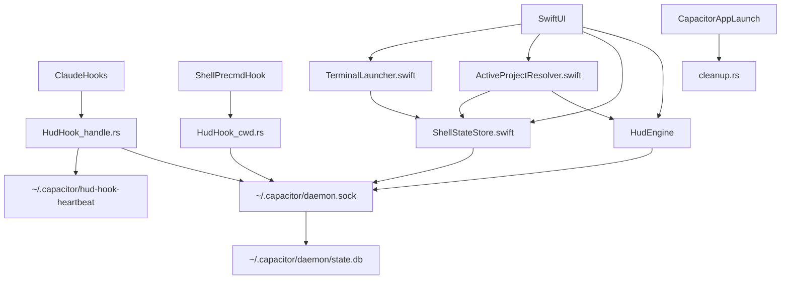
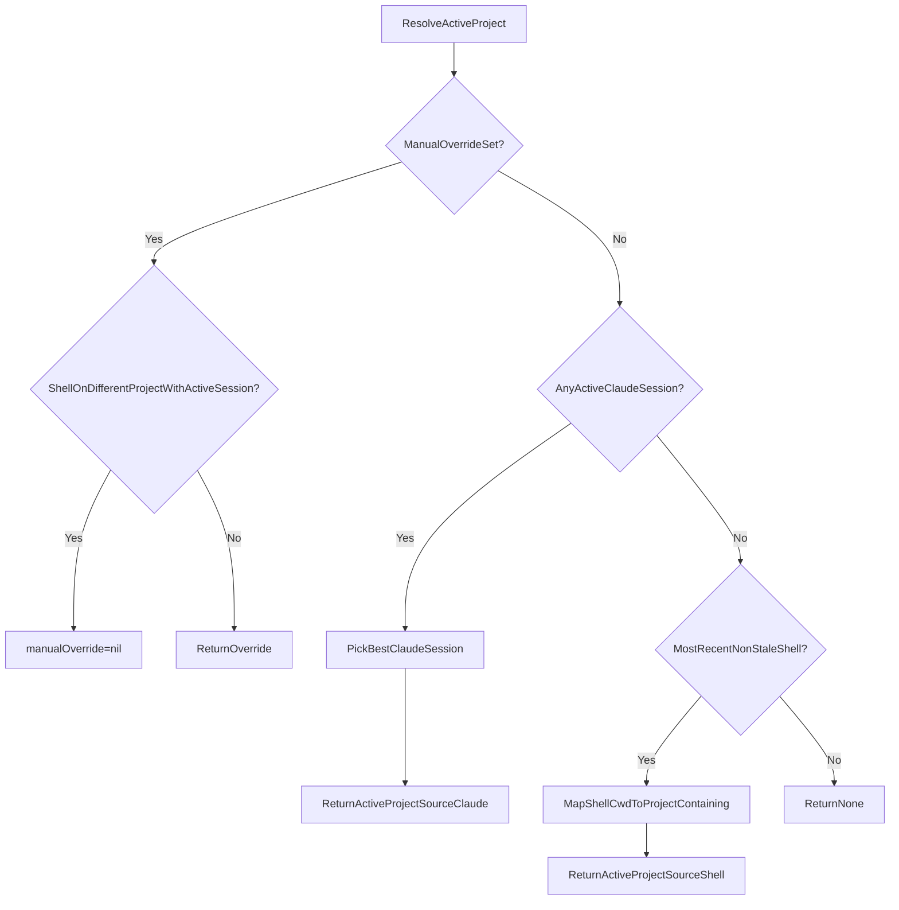

# Current System Map (Ground Truth)

> **Daemon-only note (2026-02):** This audit describes pre-daemon file/lock behavior. In daemon-only mode, these paths are legacy and should not be authoritative.
This document is the **canonical map** of Capacitor’s state detection + activation systems **as implemented today**.

It is written to prevent regressions caused by “fixing the visible symptom” in one subsystem while violating assumptions in another.

## What this covers

- **Session state detection** (daemon-only; legacy file artifacts are deprecated)
- **Active project selection** (manual override vs Claude vs shell CWD)
- **Terminal activation** (tmux + TTY matching + app activation)
- **Cleanup & self-healing** (startup cleanup, tombstones, heartbeat)
- **Side effects** (filesystem/processes/signals) and the invariants they imply

## Canonical file paths (Capacitor namespace)

All files below are in Capacitor’s namespace (`~/.capacitor/`) and are safe to reset.

| Path | Producer(s) | Consumer(s) | Purpose |
|------|-------------|-------------|---------|
| `~/.capacitor/daemon.sock` | `capacitor-daemon` (LaunchAgent) | `hud-hook`, Swift app, `hud-core` | IPC channel (primary state reads/writes) |
| `~/.capacitor/daemon/state.db` | `capacitor-daemon` | `capacitor-daemon` | SQLite WAL store (authoritative state) |
| `~/.capacitor/daemon/daemon.stdout.log` | LaunchAgent | User | Daemon stdout log |
| `~/.capacitor/daemon/daemon.stderr.log` | LaunchAgent | User | Daemon stderr log |
| `~/.capacitor/sessions.json` | **Legacy** | **Deprecated** | Historical session snapshot (daemon-only mode disables writes/reads) |
| `~/.capacitor/sessions/{session_id}-{pid}.lock/` | **Legacy** | **Deprecated** | Historical lock dirs (daemon-only mode disables writes/reads) |
| `~/.capacitor/ended-sessions/{session_id}` | **Legacy** | **Deprecated** | Historical tombstones (daemon-only mode disables writes/reads) |
| `~/.capacitor/file-activity.json` | **Legacy** | **Deprecated** | Historical activity fallback (daemon-only mode disables writes/reads) |
| `~/.capacitor/shell-cwd.json` | **Legacy** | **Deprecated** | Historical shell snapshot (daemon-only mode uses IPC) |
| `~/.capacitor/shell-history.jsonl` | **Legacy** | **Deprecated** | Historical shell history (daemon-only mode uses IPC) |
| `~/.capacitor/hud-hook-heartbeat` | `hud-hook handle` | Swift setup/health UI | “Hooks are firing” proof-of-life |

## Canonical external paths (non-Capacitor namespaces)

| Path | Owner | Producer(s) | Consumer(s) | Notes |
|------|-------|-------------|-------------|------|
| `~/.claude/settings.json` | Claude | Capacitor modifies **hooks only** | Claude + Capacitor | Must preserve non-hook config (`serde(flatten)` in `setup.rs`) |
| `~/.local/bin/hud-hook` | User bin | Capacitor installer | Claude hooks | **Symlink** strategy is required (copy can trigger Gatekeeper SIGKILL in dev) |

## High-level data flow (daemon-only)



## Session lifecycle (daemon-only)

```mermaid
sequenceDiagram
    participant Claude as ClaudeProcess
    participant Hook as hudHook_handle
    participant Daemon as daemon.sock

    Claude->>Hook: HookEvent(SessionStart/UserPromptSubmit)
    Hook->>Hook: touch_heartbeat()
    Hook->>Daemon: send Event
    Hook-->>Claude: exit

    Claude->>Hook: HookEvent(PostToolUse/PreToolUse/etc)
    Hook->>Hook: has_tombstone? if yes, skip
    Hook->>Daemon: send Event
    Hook-->>Claude: exit

    Claude->>Hook: HookEvent(SessionEnd)
    Hook->>Daemon: send Event
    Hook-->>Claude: exit

    Note over Hook,Daemon: Daemon-only; no file-based fallback writes
```

## Project session state resolution (Rust)

**Legacy (pre-daemon) fallback logic:** This section documents the old resolver path when daemon snapshots were unavailable. In daemon-only mode this path should not be used.

```mermaid
flowchart TD
    Query[ProjectPathQuery] --> DaemonCheck{DaemonSnapshotAvailable?}
    DaemonCheck -->|Yes| DaemonState[Use daemon sessions/activity]
    DaemonCheck -->|No| Load[LoadStateStore(sessions.json)]
    Load --> Resolve[resolve_state_with_details]

    Resolve --> LocksExist{AnyActiveLockForExactPath?}
    LocksExist -->|Yes| PickLock[PickMatchingLock]
    PickLock --> RecordForLock[FindRecordForLockPath]
    RecordForLock --> FromLock[ReturnState(is_from_lock=true)]

    LocksExist -->|No| FreshRecord{FreshExactMatchRecord?}
    FreshRecord -->|Yes| ActiveStale{ActiveStateStale?}
    ActiveStale -->|Yes| ReadyFallback[ReturnReady(is_from_lock=false)]
    ActiveStale -->|No| RecordState[ReturnRecordState(is_from_lock=false)]

    FreshRecord -->|No| ActivityCheck{RecentActivityInPath?}
    ActivityCheck -->|Yes| WorkingByActivity[ReturnWorking(is_locked=false)]
    ActivityCheck -->|No| Idle[ReturnIdle]
```

Important derived behavior implemented in `sessions.rs`:
- **Ready → Idle** after 15 minutes **only when not from lock** (no liveness proof).

## Active project selection (Swift)



Key asymmetry (intentional):
- **Locks/records** use **exact-match-only** (monorepo isolation).
- **Shell CWD → project** uses **child-path matching** (`/project/src` highlights `/project`) because it’s user navigation, not session isolation.

## Terminal activation (Swift)

Terminal activation is a best-effort UX feature; it should **never** affect session correctness.

```mermaid
flowchart TD
    Launch[launchTerminal(forProject)] --> QueryTmux{DirectTmuxSessionForPath?}
    QueryTmux -->|Yes| TmuxClient{tmuxClientAttached?}
    TmuxClient -->|Yes| SwitchClient[tmux switch-client]
    TmuxClient -->|No| LaunchTmux[LaunchTerminalWithTmuxSession]

    QueryTmux -->|No| FindShell{ExactMatchShellInShellCwd?}
    FindShell -->|Yes| Strategy[RunActivationStrategy]
    FindShell -->|No| LaunchNew[LaunchNewTerminal]

    Strategy --> ActivateTTY{TerminalSupportsTTYSelection?}
    ActivateTTY -->|Yes| AppleScriptSelect[AppleScriptSelectByTTY]
    ActivateTTY -->|No| ActivateApp[ActivateAppOnly]
```

## Startup cleanup (Rust, daemon-aware)

This runs once per app launch to remove cruft and reduce stale-state confusion. In daemon-only mode, file-based cleanup is skipped; legacy steps below are historical.

```mermaid
flowchart TD
    Start[run_startup_cleanup] --> KillOrphans[cleanup_orphaned_lock_holders]
    KillOrphans --> LegacyLocks[cleanup_legacy_locks]
    LegacyLocks --> StaleLocks[cleanup_stale_locks]
    StaleLocks --> OrphanSessions[cleanup_orphaned_sessions]
    OrphanSessions --> OldSessions[cleanup_old_sessions]
    OldSessions --> OldTombstones[cleanup_old_tombstones]
    OldTombstones --> Done[ReturnCleanupStats]
    Note right of Start: OrphanSessions/OldSessions/Activity cleanup skipped when daemon healthy
```

## Cross-cutting invariants (assumptions you must not violate)

These are the “contract points” between subsystems. Breaking them tends to create cascading regressions.

- **Invariant_LockMeansLiveness (legacy)**: Lock dirs are trusted only if PID verification passes.
  - Historical note: lock-holder timeout bug (audit 02) no longer relevant in daemon-only mode.
- **Invariant_DaemonAuthoritative**: When daemon health is OK, daemon snapshots are the source of truth and file artifacts are fallback-only.
  - File cleanup should not mutate fallback data while daemon is healthy.
- **Invariant_ExactMatchOnlyForSessions**: Session state resolution does **not** inherit parent/child paths.
  - Child sessions do not affect parent cards, and vice versa.
- **Invariant_CapacitorOwnsCapacitorNamespace**: Anything in `~/.capacitor/` must be safe to delete/reset.
  - Every user-facing “Repair/Reset” flow depends on this.
- **Invariant_ClaudeNamespaceIsReadMostly**: We only modify `~/.claude/settings.json` hooks entries and preserve everything else.
- **Invariant_ActivationIsBestEffort**: Terminal activation failures must not change session detection state.

## Drift ledger (docs that have been historically misleading)

These are common sources of agent regressions:
- `.claude/docs/side-effects-map.md` historically referenced outdated paths (legacy lock format, activity path).
- `docs/architecture-decisions/001-state-tracking-approach.md` contains legacy lock examples.

This document (and the audits in `.claude/docs/audit/`) should be treated as the canonical reference for current behavior.
