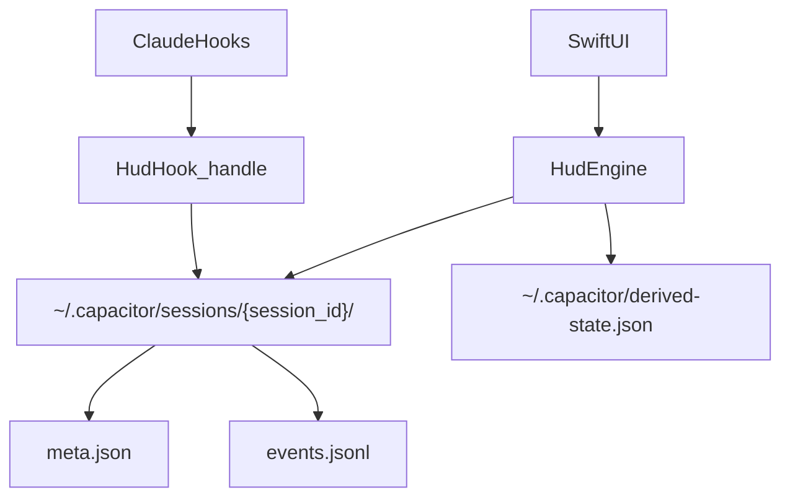

# vNext Minimal Side Effects Baseline (OptionB: Per-Session Directories)

> **Daemon-only note (2026-02):** This audit describes pre-daemon file/lock behavior. In daemon-only mode, these paths are legacy and should not be authoritative.
This document defines what we keep vs retire when adopting the **recommended** storage design from:\n
[`docs/architecture-decisions/004-simplify-state-storage.md`](../../../docs/architecture-decisions/004-simplify-state-storage.md).

The purpose is to make the system **hard to regress** by shrinking the number of “authoritative” side-effect stores and eliminating multi-writer snapshot files.

---

## Target: single-source session truth

For **session detection + project association**, the target is:

- **Hook writes**: append-only per-session events + minimal per-session metadata
- **App/core writes** (optional): derived snapshots / indexes (single-writer)
- **Everything else** (locks, tombstones, global activity maps) becomes **derived** or unnecessary

---

## Minimal artifacts to keep (session/project state)

These are the **only** persistent artifacts required for state detection under the new design.

### 1) Per-session directory

| Artifact | Writer | Why it exists | Notes |
|---------|--------|---------------|-------|
| `~/.capacitor/sessions/{session_id}/meta.json` | `hud-hook` | Stable session identity + PID/proc_started verification + stable `project_dir` | Written on SessionStart and updated only if needed (prefer immutable) |
| `~/.capacitor/sessions/{session_id}/events.jsonl` | `hud-hook` | Append-only event history for reconciliation | Prefer `flock()` during append to avoid interleaving |

### 2) Optional derived snapshot (single-writer)

| Artifact | Writer | Why it exists | Notes |
|---------|--------|---------------|-------|
| `~/.capacitor/derived-state.json` (or similar) | App (`hud-core`/Swift) | Fast reads + diagnostics + stable UI | Single-writer; can be deleted and rebuilt from per-session dirs |

### 3) Keep unchanged (not replaced by this ADR)

These remain as-is because they solve a different problem (ambient shell awareness + hook health).

| Artifact | Writer | Purpose |
|---------|--------|---------|
| `~/.capacitor/shell-cwd.json` | `hud-hook cwd` | Ambient “where is the user working” signal |
| `~/.capacitor/shell-history.jsonl` | `hud-hook cwd` | Debugging / historical navigation |
| `~/.capacitor/hud-hook-heartbeat` | `hud-hook handle` | Proof-of-life that hooks are firing |
| `~/.capacitor/hud-hook-debug.*.log` | `hud-hook` | Debug logging |

---

## Artifacts to retire (become unnecessary)

These are the pieces most strongly associated with regressions because they are either **multi-writer snapshots**, **non-atomic read-modify-write**, or **extra “coordination stores”**.

| Artifact | Status under OptionB | Why we can remove it |
|---------|-----------------------|----------------------|
| `~/.capacitor/sessions.json` | **Remove** (after migration) | Replaced by per-session event logs; eliminates cleanup-vs-hook write clobber |
| `~/.capacitor/file-activity.json` | **Remove** (after migration) | File activity is represented directly as events; eliminates duplicated implementations + non-atomic writes |
| `~/.capacitor/ended-sessions/*` | **Remove** (after migration) | Late events are handled by reconciliation rules; SessionEnd in the log is the boundary |
| `~/.capacitor/sessions/*.lock/` | **Remove** (after migration) | Liveness is derived from `(pid, proc_started)` in `meta.json`/events |
| `hud-hook lock-holder` process | **Remove** (after migration) | No separate lock store; removing eliminates lifecycle + timeout failure modes |

---

## Subsystem mapping (today → vNext)

| Current subsystem | Current role | vNext disposition |
|------------------|-------------|------------------|
| **StateStore (`sessions.json`)** | Global session record store | Replaced by per-session dirs + reconciler |
| **Lock system** | Liveness proof + stable path association | Fold into `meta.json` + pid verification (no locks) |
| **Lock holder** | Removes locks on PID exit | Removed |
| **Tombstones** | Prevent late events recreating ended sessions | Removed (handled by reconciliation ordering) |
| **Activity file** | Secondary monorepo “working” signal | Removed (activity is just events) |
| **Cleanup system** | Removes stale locks/sessions/tombstones | Simplified: cleanup old session dirs + rotate derived snapshot |
| **Shell CWD tracking** | Ambient project awareness + activation | Keep (unchanged) |
| **Terminal launcher** | Best-effort activation | Keep (but separate hardening work later) |

---

## Minimal cleanup responsibilities (vNext)

Cleanup becomes straightforward and low-risk because the unit of cleanup is a session directory.

Suggested policies:

- **Session dir retention**:\n
  - keep ended sessions for \(N\) days (e.g., 7–30) for diagnostics\n
  - purge ended sessions beyond retention\n
  - keep active sessions always
- **Event log caps**:\n
  - cap per-session `events.jsonl` by size (e.g., 1–5MB) or by time window\n
  - optional: compact events into `derived.json` and truncate old events
- **Derived snapshot**:\n
  - always safe to delete\n
  - rebuilt at app launch

---

## Non-negotiable invariants (vNext)

These invariants define the “robustness contract” to enforce via tests.

- **Invariant_SingleWriterDerived**: any derived snapshot/index file is written by the app only.\n
  - hooks never rewrite global snapshots.
- **Invariant_NoSharedMutableMapsFromHooks**: hooks never perform whole-file merges of multi-session state.\n
  - per-session dirs only.
- **Invariant_SessionLivenessByPidVerification**: liveness requires `(pid, proc_started)` verification.\n
  - stale PIDs must not resurrect sessions.\n
- **Invariant_ProjectAssociationStable**: `project_dir` (session’s stable association) is determined once.\n
  - cd within a session updates `cwd`, not `project_dir`.\n
- **Invariant_MonorepoViaActivityEvents**: package “working” is derived from file activity events.\n
  - no separate global activity store.

---

## Migration note

During migration we will temporarily have “extra” artifacts (dual-write). The goal is to aggressively measure mismatch rates and only then delete old stores (see ADR-004).

