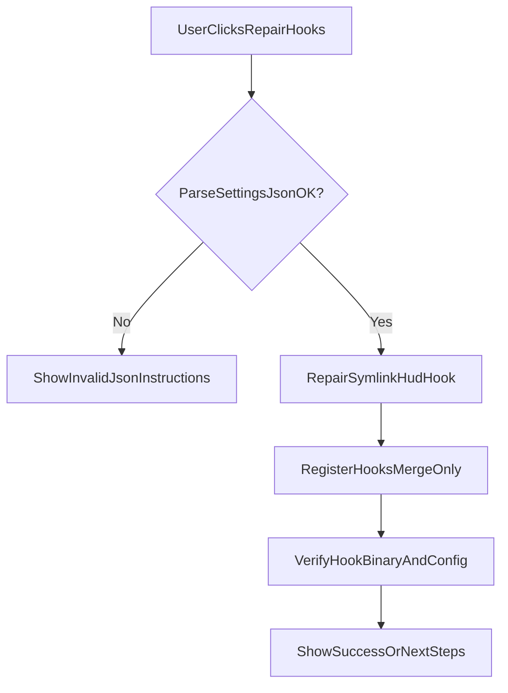

# Recovery & Safety Net Design

This document specifies the user-facing recovery surface that guarantees users can always recover from bad/stale state, and defines strict safety rules for anything that touches `~/.claude/` or `~/.local/bin/`.

It is intentionally conservative: **Capacitor must never strand users** in a broken configuration or confusing state.

---

## What “unrecoverable” means (explicit)

A state is “unrecoverable” if the user cannot return the app to a correct baseline without:
- editing files manually, or
- deleting unknown data in `~/.claude/`, or
- reinstalling the app.

The design below aims to make recovery possible from inside the app with **one click**.

---

## User-facing surfaces

### 1) “System Health” screen (always available)

Location: Settings → System (or existing Setup UI).

Shows:
- **Hooks installed** (settings.json contains required hook entries)\n
- **Hook binary healthy** (symlink target exists + binary runs)\n
- **Hooks firing** (heartbeat recency)\n
- **State store healthy** (can parse current artifacts)\n
- **Shell integration healthy** (shell-cwd present + non-stale shells)\n

Provides actions:
- **Repair hooks** (safe, idempotent)\n
- **Run cleanup** (safe, Capacitor namespace only)\n
- **Reset session tracking** (destructive to session tracking only)\n
- **Export diagnostics** (for support)

### 2) Inline “SetupStatusCard” errors (blocking only when required)

Principle: **only block** when the system cannot possibly function correctly (e.g., hooks not firing at all).

Otherwise:
- show degraded mode (shell-only highlight, no session states), with clear explanation.

### 3) “Diagnostics export” flow

Produces a zip (or folder) with:
- hook install status summary\n
- `~/.local/bin/hud-hook` symlink info (path + target + existence)\n
- last N lines of `hud-hook-debug.*.log`\n
- list of files in `~/.capacitor/` (names + sizes + timestamps)\n
- session tracking artifacts (event logs / derived snapshots) **optional, user-confirmed**

**Redaction rules:** no transcript contents from `~/.claude/projects/`, no file contents from user repos.

---

## Health checks (exact checks + outputs)

### Hook installation (Claude namespace)

Checks:
- `~/.claude/settings.json` exists\n
- JSON parses\n
- required hook events present\n
- async hooks have both `"async": true` and `"timeout": 30` (per Claude validation)

Outputs:
- status: `Installed | NotInstalled | PolicyBlocked | InvalidJSON | MissingEvents`\n
- recommended fix: “Repair hooks” or “Open settings.json (read-only)”

### Hook binary (system namespace)

Checks:
- `~/.local/bin/hud-hook` exists\n
- if symlink:\n
  - can read link target\n
  - target exists\n
- can execute `hud-hook --version` (or similar safe command)

Outputs:
- status: `OK | Missing | SymlinkBroken | NotExecutable | GatekeeperKilled`\n
- recommended fix: “Reinstall symlink from app bundle”

### Hook runtime health (Capacitor namespace)

Checks:
- `~/.capacitor/hud-hook-heartbeat` exists\n
- timestamp is recent (e.g., < 60s) *while* Claude sessions are expected

Outputs:
- status: `Firing | Stale | Missing`\n
- recommended fix: “Open hooks diagnostics” (shows last heartbeat time + install status)

### State artifacts health (Capacitor namespace)

Checks:
- known state files parse\n
- known directories exist\n
- derived snapshots can be rebuilt (if vNext storage)

Outputs:
- status: `OK | CorruptButRecoverable | Missing`\n
- recommended fix: “Reset session tracking” or “Rebuild derived state”

### Shell integration health (Capacitor namespace)

Checks:
- `~/.capacitor/shell-cwd.json` exists\n
- parses\n
- contains at least one non-stale shell entry\n

Outputs:
- status: `Configured | FileExistsButEmpty | Missing`\n
- recommended fix: “Show shell setup instructions”

---

## Repair actions (idempotent + safe)

### Action: Repair hooks

Does (in order):
1. Validate `~/.claude/settings.json` parses.\n
2. If invalid JSON: **do not modify**. Provide user instructions.\n
3. Install/repair `~/.local/bin/hud-hook` symlink.\n
4. Register hooks in settings.json (merge only into hooks).\n
5. Verify by checking for a heartbeat update after a **real hook event** (e.g., start a Claude session). The “Test Hooks” button only reads heartbeat/state—it doesn’t generate one.

Safety:
- Always atomic writes when modifying settings.\n
- Preserve unknown fields (`serde(flatten)` pattern).\n
- Never touch `~/.claude/projects/` or transcripts.\n

### Action: Run cleanup

Does:
- removes stale Capacitor artifacts only.\n
- **never** modifies `~/.claude/`.\n

### Action: Rebuild derived state (vNext)

Does:
- deletes `~/.capacitor/derived-state.json` (or moves to `backup/`).\n
- rebuilds from session directories.\n

---

## Reset actions (guaranteed escape hatches)

### Reset: Session tracking only (recommended default)

Deletes only “session tracking” artifacts:
- `~/.capacitor/sessions.json`\n
- `~/.capacitor/sessions/*.lock/`\n
- `~/.capacitor/ended-sessions/*`\n
- `~/.capacitor/file-activity.json`\n
- `~/.capacitor/hud-hook-heartbeat`\n
- (optional) `~/.capacitor/sessions/{session_id}/` (vNext)\n

Does **not** delete:
- `~/.capacitor/config.json`\n
- pinned projects, ideas, stats cache, etc.

### Reset: All Capacitor data (explicit + scary)

Deletes entire `~/.capacitor/` directory.\n
This is the “nuclear option” and must be clearly labeled as data-loss for Capacitor-owned features (pinned projects, ideas, settings).

---

## Non-negotiable safety guarantees

### Claude namespace (`~/.claude/`)

- **Never** modify anything except `settings.json` and only the `hooks` entries.\n
- **Never** delete or rewrite other fields.\n
- If `settings.json` is invalid JSON:\n
  - do not overwrite\n
  - provide clear instructions\n

### System namespace (`~/.local/bin/`)

- Prefer symlink installation.\n
- If an existing file is present:\n
  - replace only after verifying it is a Capacitor-managed install OR after explicit user consent\n
  - optionally back up to `~/.capacitor/backups/` with timestamp

### Capacitor namespace (`~/.capacitor/`)

- Safe to delete/reset at any time.\n
- All writes must be atomic or append-only with safe tail corruption handling.\n
- Corrupt files must never crash the app; they must degrade gracefully.

---

## Interaction flow (Repair)

---

## How this reduces churn risk

Users lose trust when:\n
- UI freezes\n
- state is wrong with no explanation\n
- fixes require editing dotfiles\n

This safety net gives them:\n
- clear diagnosis\n
- one-click repair/reset\n
- an export artifact they can send to you for support
