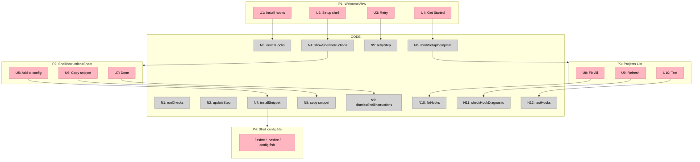

# Public Alpha — Onboarding (Shaping)

## Source

> ## 3. Onboarding — Streamline for Alpha
> 
> The current `WelcomeView` is step-by-step with hook installation + shell setup. Needs to feel polished for first-time users.
> 
> - [ ] **Audit current flow** — Walk through WelcomeView end-to-end, note friction points
> - [ ] **Simplify requirements checks** — Hook install + shell integration should feel like 1-2 steps, not a checklist
> - [ ] **Basic project detection** — After setup, auto-detect projects with `.claude/` or `CLAUDE.md` and offer to add them
> - [ ] **Clear error states** — If something fails, the user knows exactly what to do
> - [ ] **Setup card in project list** — Should only appear when hooks are genuinely broken, not as a first-run artifact
> - [ ] **Copy-to-clipboard shell instructions** — Must work perfectly for zsh (primary), bash, fish
> - [ ] **Test the "Fix All" auto-repair path** — Should handle common hook breakage gracefully

---

## Problem

- First-run onboarding is a 3-step checklist with optional shell integration inline, which feels heavier than needed for alpha.
- Setup errors are distributed across the WelcomeView and the in-list SetupStatusCard, which can show up on first run even when hooks are just idle.
- After setup, users are not proactively guided to add an existing project; no auto-detection of `.claude/` or `CLAUDE.md`.

## Outcome

- Onboarding feels like 1–2 clear steps (hooks + optional shell) with concise, actionable error states.
- SetupStatusCard only appears when hooks are genuinely broken, not merely idle on first run.
- After setup, the app detects likely projects and offers a fast add flow.
- Shell instructions copy/install flows are reliable for zsh, bash, fish.
- Users understand what hooks/daemon setup changes and what metadata is captured.

---

## Requirements (R)

| ID | Requirement | Status |
|----|-------------|--------|
| R0 | First-run onboarding is 1–2 steps, not a multi-row checklist | Core goal |
| R1 | Hook install success/failure states are explicit and actionable | Must-have |
| R2 | Shell integration is clearly optional and low-friction | Must-have |
| R3 | SetupStatusCard only appears when hooks are genuinely broken | Must-have |
| R4 | After setup, app detects existing projects and offers to add them | Must-have |
| R5 | Error states explain what to do next (copy, retry, open file) | Must-have |
| R6 | Copy-to-clipboard and auto-install work for zsh/bash/fish | Must-have |
| R7 | Setup is transparent about hook/daemon changes + metadata captured | Must-have |

---

## A: Simplified setup + optional shell + post-setup project detection

| Part | Mechanism | Flag |
|------|-----------|:----:|
| **A1** | Replace 3-step checklist with a compact “Setup” flow: primary hook install + optional shell step | |
| **A2** | Centralize error messaging for hooks + shell with explicit actions | |
| **A3** | Post-setup project scan for `.claude/` or `CLAUDE.md` and offer quick add | |
| **A4** | Ensure SetupStatusCard only shows for genuine failures (not first-run idle) | |
| **A5** | Add transparency copy about hooks/daemon changes + metadata capture | |

## B: Auto-install hooks + minimal first-run prompt

| Part | Mechanism | Flag |
|------|-----------|:----:|
| **B1** | Auto-run hook install on first launch; show spinner + result | ⚠️ |
| **B2** | Show shell instructions only if user opts in | |
| **B3** | Post-setup project scan + quick add | ⚠️ |
| **B4** | Add transparency copy about hooks/daemon changes + metadata capture | |

## Fit Check

| Req | Requirement | Status | A | B |
|-----|-------------|--------|---|---|
| R0 | First-run onboarding is 1–2 steps, not a multi-row checklist | Core goal | ✅ | ✅ |
| R1 | Hook install success/failure states are explicit and actionable | Must-have | ✅ | ✅ |
| R2 | Shell integration is clearly optional and low-friction | Must-have | ✅ | ✅ |
| R3 | SetupStatusCard only appears when hooks are genuinely broken | Must-have | ✅ | ✅ |
| R4 | After setup, app detects existing projects and offers to add them | Must-have | ✅ | ⚠️ |
| R5 | Error states explain what to do next (copy, retry, open file) | Must-have | ✅ | ✅ |
| R6 | Copy-to-clipboard and auto-install work for zsh/bash/fish | Must-have | ✅ | ✅ |
| R7 | Setup is transparent about hook/daemon changes + metadata captured | Must-have | ✅ | ✅ |

**Notes:**
- A3/B3 require a project scan mechanism (needs design + implementation plan).

---

## Selected Shape

**A — Simplified setup + optional shell + post-setup project detection** is selected. It retains explicit user control, minimizes UI changes, and keeps error handling predictable while still reducing onboarding friction.

---

## CURRENT: Onboarding + Setup Repair

### Places

| # | Place | Description |
|---|-------|-------------|
| P1 | WelcomeView | First-run setup checklist (claude, hooks, shell) + Get Started |
| P2 | ShellInstructionsSheet | Modal sheet for shell snippet instructions + auto-install |
| P3 | Projects List | Main list, may show SetupStatusCard when hooks are unhealthy |
| P4 | Shell config file (system) | Target file for shell snippet installation |

### UI Affordances

| # | Place | Component | Affordance | Control | Wires Out | Returns To |
|---|-------|-----------|------------|---------|-----------|------------|
| U1 | P1 | SetupStepRow | “Install” (hooks) | click | → N3 | — |
| U2 | P1 | SetupStepRow | “Setup” (shell) | click | → N4 | — |
| U3 | P1 | SetupStepRow | “Retry” | click | → N5 | — |
| U4 | P1 | WelcomeView | “Get Started” | click | → N6 | — |
| U5 | P2 | ShellInstructionsSheet | “Add to config” | click | → N7 | — |
| U6 | P2 | ShellInstructionsSheet | “Copy” snippet | click | → N8 | — |
| U7 | P2 | ShellInstructionsSheet | “Done” | click | → N9 | — |
| U8 | P3 | SetupStatusCard | “Fix All” | click | → N10 | — |
| U9 | P3 | SetupStatusCard | “Refresh” | click | → N11 | — |
| U10 | P3 | SetupStatusCard | “Test” | click | → N12 | — |

### Code Affordances

| # | Place | Component | Affordance | Control | Wires Out | Returns To |
|---|-------|-----------|------------|---------|-----------|------------|
| N1 | P1 | SetupRequirementsManager | `runChecks()` | call | → N13, → N14, → N15 | — |
| N2 | P1 | SetupRequirementsManager | `updateStep(_:)` | write | — | → U1–U3 |
| N3 | P1 | SetupRequirementsManager | `installHooks()` | call | → N16 | → N2 |
| N4 | P1 | SetupRequirementsManager | `showShellInstructions = true` | write | → P2 | — |
| N5 | P1 | SetupRequirementsManager | `retryStep(_:)` | call | → N13, → N15 | — |
| N6 | P1 | CapacitorConfig | `markSetupComplete()` | call | → P3 | — |
| N7 | P2 | ShellType | `installSnippet()` | call | → P4 | — |
| N8 | P2 | NSPasteboard | `setString(snippet)` | call | — | — |
| N9 | P2 | SetupRequirementsManager | `dismissShellInstructions()` | call | → N15 | — |
| N10 | P3 | AppState | `fixHooks()` | call | → N16 | → N11 |
| N11 | P3 | AppState | `checkHookDiagnostic()` | call | → N17 | → U8–U10 |
| N12 | P3 | AppState | `testHooks()` | call | — | → U10 |
| N13 | P1 | HudEngine | `checkSetupStatus()` | call | — | → N2 |
| N14 | P1 | HudEngine | `checkDependency(name:)` | call | — | → N2 |
| N15 | P1 | ShellIntegrationChecker | `isConfigured(...)` | call | — | → N2 |
| N16 | P1/P3 | HudEngine | `installHooks()` | call | — | → N2/N11 |
| N17 | P3 | HudEngine | `getHookDiagnostic()` | call | — | → U8–U10 |

**Notes**
- SetupStatusCard rendering is controlled by `HookDiagnosticReport.shouldShowSetupCard`.
- WelcomeView always shows a 3-step checklist with optional shell integration.

### CURRENT Wiring Diagram

---

## Slices

See `/Users/petepetrash/Code/capacitor/.claude/slices-onboarding.md`.
