# Public Alpha — Feature Gating (Shaping)

## Source

> ## 1. Feature Gating — Hide What's Not Shipping
> 
> These features exist in the codebase but are **out of scope** for alpha.
> 
> - [ ] **Hide Workstreams/Worktrees** — Remove or gate `WorkstreamsPanel` from UI; remove "Create Workstream" actions from project cards and detail views
> - [ ] **Hide Idea Capture** — Remove `⌘+I` shortcut, idea capture button on project cards, `IdeaQueueView`, `IdeaDetailModal`, and `IdeaCaptureOverlay`
> - [ ] **Hide Project Details View** — Remove navigation to `ProjectDetailView` (info button on cards, detail push); cards should be action-only (open terminal, pause, remove)
> - [ ] **Hide Project Creation (NewIdeaView)** — Remove `ActivityPanel`, `NewIdeaView`, and any "create project from idea" flows
> - [ ] **Hide LLM-powered features** — Description generation, idea enrichment/sensemaking — none of these ship in alpha
> - [ ] **Hide Debug menu items** — Ensure debug panels/views are stripped from release builds

---

## Problem

- Public alpha scope is meant to be an observe-only sidecar, but the UI still exposes workstreams, idea capture, project details, and project creation flows.
- Gating is partially implemented (feature flags), yet multiple UI affordances and navigation paths still exist in the codebase and need a reliable, consistent hide/disable pass.
- Release builds must ensure debug-only affordances are stripped and non-alpha features are unreachable.

## Outcome

- Alpha builds expose only the intended surface area: project list + terminal activation + pause/revive + remove/link; no workstreams, no ideas, no project details, no project creation.
- All entry points (buttons, shortcuts, navigation paths, overlays) for out-of-scope features are removed or gated consistently.
- Release builds compile without debug menus/panels and hide LLM-powered description generation.

---

## Requirements (R)

| ID | Requirement | Status |
|----|-------------|--------|
| R0 | Alpha build exposes only in-scope features (no workstreams, idea capture, project details, project creation, LLM features) | Core goal |
| R1 | All UI entry points and shortcuts for out-of-scope features are removed or gated | Must-have |
| R2 | Programmatic navigation paths to hidden views are blocked (guards or compile-time removal) | Must-have |
| R3 | Debug menus/panels are stripped from release builds | Must-have |
| R4 | Feature gating is centralized and easy to audit | Must-have |
| R5 | Non-alpha builds retain current feature access (unless explicitly disabled) | Undecided |

---

## A: Channel + FeatureFlags gating (UI pruning)

| Part | Mechanism | Flag |
|------|-----------|:----:|
| **A1** | Extend `FeatureFlags` to cover workstreams, project creation, LLM features (plus existing idea capture + project details) | |
| **A2** | Gate UI entry points (ProjectCard info/capture, ActivityPanel, WorkstreamsPanel, IdeaQueueView, IdeaDetailModal, IdeaCaptureOverlay) | |
| **A3** | Guard navigation + overlay rendering (NavigationContainer, ContentView, AppState show* methods) | |
| **A4** | Remove/disable shortcuts and commands tied to hidden features | |

## B: Alpha build target (compile-time pruning)

| Part | Mechanism | Flag |
|------|-----------|:----:|
| **B1** | Add `ALPHA` build flag or scheme; use `#if ALPHA` to strip UI + commands | |
| **B2** | Keep dev/prod behavior untouched; alpha build compiles without out-of-scope code paths | |
| **B3** | Confirm release pipeline writes `CapacitorChannel=alpha` (or equivalent) | |

## Fit Check

| Req | Requirement | Status | A | B |
|-----|-------------|--------|---|---|
| R0 | Alpha build exposes only in-scope features (no workstreams, idea capture, project details, project creation, LLM features) | Core goal | ✅ | ✅ |
| R1 | All UI entry points and shortcuts for out-of-scope features are removed or gated | Must-have | ✅ | ✅ |
| R2 | Programmatic navigation paths to hidden views are blocked (guards or compile-time removal) | Must-have | ✅ | ✅ |
| R3 | Debug menus/panels are stripped from release builds | Must-have | ✅ | ✅ |
| R4 | Feature gating is centralized and easy to audit | Must-have | ✅ | ❌ |
| R5 | Non-alpha builds retain current feature access (unless explicitly disabled) | Undecided | ✅ | ✅ |

**Notes:**
- B fails R4 because compile-time pruning spreads gating across multiple files and is harder to audit versus a single feature-flag surface.

---

## Selected Shape

**A — Channel + FeatureFlags gating (UI pruning)** is selected. It keeps gating centralized, aligns with existing `AppConfig`/`FeatureFlags`, and preserves non-alpha behavior without scattering compile-time conditionals.

---

## CURRENT: Project list + detail + idea capture + workstreams + new idea

### Places

| # | Place | Description |
|---|-------|-------------|
| P1 | Projects List (ProjectsView) | Primary list of active/paused projects and cards |
| P2 | Project Detail View (ProjectDetailView) | Detail page with description, workstreams, idea queue |
| P3 | Idea Detail Modal (IdeaDetailModalOverlay) | Modal overlay for a specific idea |
| P4 | Idea Capture Modal (IdeaCaptureModalOverlay) | Full-screen capture overlay for new ideas |
| P5 | New Idea View (NewIdeaView) | Project creation form for "Claude builds a v1" |

### UI Affordances

| # | Place | Component | Affordance | Control | Wires Out | Returns To |
|---|-------|-----------|------------|---------|-----------|------------|
| U1 | P1 | ProjectCardView | Info button | click | → N1 | — |
| U2 | P1 | ProjectCardView | Capture Idea… button | click | → N2 | — |
| U3 | P1 | ProjectCardView | Project card (tap) | click | → N3 | — |
| U4 | P1 | ActivityPanel | Creation card “Open” | click | → N3 | — |
| U5 | P2 | ProjectDetailView | Back button | click | → N4 | — |
| U6 | P2 | WorkstreamsPanel | “New Workstream” | click | → N5 | — |
| U7 | P2 | WorkstreamsPanel | “Open” workstream | click | → N6 | — |
| U8 | P2 | WorkstreamsPanel | “Destroy/Force Destroy” | click | → N7 | — |
| U9 | P2 | IdeaQueueView | Idea row | click | → N8 | — |
| U10 | P2 | IdeaQueueView | Reorder drag | drag | → N9 | — |
| U11 | P2 | IdeaQueueView | Remove idea | click | → N10 | — |
| U12 | P3 | IdeaDetailModalOverlay | Dismiss modal | click | → N12 | — |
| U13 | P3 | IdeaDetailModalOverlay | Remove idea | click | → N10, → N12 | — |
| U14 | P4 | IdeaCaptureModalOverlay | Save idea | click | → N11, → N12 | — |
| U15 | P4 | IdeaCaptureModalOverlay | Cancel | click | → N12 | — |
| U16 | P5 | NewIdeaView | Create project | click | → N13 | — |
| U17 | P5 | NewIdeaView | Back button | click | → N4 | — |

### Code Affordances

| # | Place | Component | Affordance | Control | Wires Out | Returns To |
|---|-------|-----------|------------|---------|-----------|------------|
| N1 | P1 | AppState | `showProjectDetail(project)` | call | → P2 | — |
| N2 | P1 | AppState | `showIdeaCaptureModal(for:from:)` | call | → P4 | — |
| N3 | P1 | AppState | `launchTerminal(for:)` | call | → TerminalLauncher | — |
| N4 | P1/P2/P5 | AppState | `showProjectList()` | call | → P1 | — |
| N5 | P2 | WorkstreamsManager | `create(for:)` | call | — | — |
| N6 | P2 | WorkstreamsManager | `open(worktree)` | call | — | — |
| N7 | P2 | WorkstreamsManager | `destroy(worktreeName:for:force:)` | call | — | — |
| N8 | P2 | ProjectDetailView | `selectedIdea = idea` | write | → P3 | — |
| N9 | P2 | AppState | `reorderIdeas(_:for:)` | call | — | — |
| N10 | P2/P3 | AppState | `dismissIdea(_:for:)` | call | — | — |
| N11 | P4 | AppState | `captureIdea(for:text:)` | call | — | — |
| N12 | P3/P4 | ProjectDetailView / AppState | `selectedIdea = nil` / `showCaptureModal = false` | write | → P2 / → P1 | — |
| N13 | P5 | AppState | `createProjectFromIdea(_:completion:)` | call | — | — |
| N14 | P1 | AppState | `showNewIdea()` | call | → P5 | — |

**Notes**
- Feature gating uses `AppState.featureFlags` (`isIdeaCaptureEnabled`, `isProjectDetailsEnabled`) to guard `showProjectDetail`, `showIdeaCaptureModal`, and `showNewIdea`, plus NavigationContainer rendering.
- No explicit UI entrypoint for `showNewIdea()` found in views; NewIdeaView is reachable only via programmatic navigation.

### CURRENT Wiring Diagram

```mermaid
flowchart TB
    subgraph P1["P1: Projects List (ProjectsView)"]
        U1["U1: Info button"]
        U2["U2: Capture Idea…"]
        U3["U3: Project card tap"]
        U4["U4: Activity “Open”"]
    end

    subgraph P2["P2: Project Detail View"]
        U5["U5: Back button"]
        U6["U6: New Workstream"]
        U7["U7: Open workstream"]
        U8["U8: Destroy workstream"]
        U9["U9: Idea row"]
        U10["U10: Reorder drag"]
        U11["U11: Remove idea"]
    end

    subgraph P3["P3: Idea Detail Modal"]
        U12["U12: Dismiss"]
        U13["U13: Remove idea"]
    end

    subgraph P4["P4: Idea Capture Modal"]
        U14["U14: Save idea"]
        U15["U15: Cancel"]
    end

    subgraph P5["P5: New Idea View"]
        U16["U16: Create project"]
        U17["U17: Back button"]
    end

    subgraph code["CODE"]
        N1["N1: AppState.showProjectDetail"]
        N2["N2: AppState.showIdeaCaptureModal"]
        N3["N3: AppState.launchTerminal"]
        N4["N4: AppState.showProjectList"]
        N5["N5: WorkstreamsManager.create"]
        N6["N6: WorkstreamsManager.open"]
        N7["N7: WorkstreamsManager.destroy"]
        N8["N8: selectedIdea = idea"]
        N9["N9: AppState.reorderIdeas"]
        N10["N10: AppState.dismissIdea"]
        N11["N11: AppState.captureIdea"]
        N12["N12: close modal state"]
        N13["N13: AppState.createProjectFromIdea"]
        N14["N14: AppState.showNewIdea"]
    end

    U1 --> N1 --> P2
    U2 --> N2 --> P4
    U3 --> N3
    U4 --> N3

    U5 --> N4 --> P1
    U6 --> N5
    U7 --> N6
    U8 --> N7
    U9 --> N8 --> P3
    U10 --> N9
    U11 --> N10

    U12 --> N12 --> P2
    U13 --> N10
    U13 --> N12 --> P2

    U14 --> N11
    U14 --> N12 --> P1
    U15 --> N12 --> P1

    U16 --> N13
    U17 --> N4 --> P1

    N14 --> P5

    classDef ui fill:#ffb6c1,stroke:#d87093,color:#000
    classDef nonui fill:#d3d3d3,stroke:#808080,color:#000

    class U1,U2,U3,U4,U5,U6,U7,U8,U9,U10,U11,U12,U13,U14,U15,U16,U17 ui
    class N1,N2,N3,N4,N5,N6,N7,N8,N9,N10,N11,N12,N13,N14 nonui
```

---

## Detail A: Alpha surface (Breadboard)

### Places

| # | Place | Description |
|---|-------|-------------|
| P1 | Projects List (ProjectsView) | Primary list of active/paused projects, setup card, empty state |
| P2 | Add Project View (AddProjectView) | Drop zone + validation flow for linking projects |
| P3 | File Picker Modal (NSOpenPanel) | System folder picker modal |
| P4 | Terminal (external) | Target terminal app activated for a project |

### UI Affordances

| # | Place | Component | Affordance | Control | Wires Out | Returns To |
|---|-------|-----------|------------|---------|-----------|------------|
| U1 | P1 | AddProjectButton | “Connect Project” button | click | → N1 | — |
| U2 | P1 | ProjectCardView | Project card tap | click | → N2 | — |
| U3 | P1 | ProjectCardView | “Pause” action | click | → N3 | — |
| U4 | P1 | CompactProjectCardView | “Revive” action | click | → N4 | — |
| U5 | P1 | ProjectCardView | “Remove” action | click | → N5 | — |
| U6 | P1 | ProjectCardView | Drag reorder | drag | → N6 | — |
| U7 | P1 | EmptyProjectsView | “Link Project” button | click | → N7 | — |
| U8 | P1 | SetupStatusCard | “Fix All” button | click | → N8 | — |
| U9 | P1 | SetupStatusCard | “Refresh” button | click | → N9 | — |
| U10 | P1 | SetupStatusCard | “Test” button | click | → N10 | — |
| U11 | P1 | ContentView | Drop folders anywhere | drop | → N11 | — |
| U12 | P2 | AddProjectView | Back button | click | → N12 | — |
| U13 | P2 | AddProjectView | Drop zone click (browse) | click | → N13 | — |
| U14 | P2 | AddProjectView | Drop folder | drop | → N14 | — |
| U15 | P2 | AddProjectView | Validation primary action (Connect / Use Suggested / Create & Connect / Unhide / Go to Project) | click | → N16 | — |
| U16 | P2 | AddProjectView | Validation secondary action (Choose Different / Use Original / Connect Without) | click | → N17 | — |
| U17 | P3 | NSOpenPanel | “Select” folder | click | → N1, → N13 | — |

### Code Affordances

| # | Place | Component | Affordance | Control | Wires Out | Returns To |
|---|-------|-----------|------------|---------|-----------|------------|
| N1 | P1 | AppState | `connectProjectViaFileBrowser()` | call | → P3, → N15, → N18 | — |
| N2 | P1 | AppState | `launchTerminal(for:)` | call | → P4 | — |
| N3 | P1 | AppState | `moveToDormant(_:)` | call | → N19 | — |
| N4 | P1 | AppState | `moveToRecent(_:)` | call | → N19 | — |
| N5 | P1 | AppState | `removeProject(_:)` | call | → N20 | — |
| N6 | P1 | ProjectDropDelegate | `dropEntered` → `moveProject(from:to:in:)` | call | → N21 | — |
| N7 | P1 | AppState | `showAddProject()` | call | → P2 | — |
| N8 | P1 | AppState | `fixHooks()` | call | — | — |
| N9 | P1 | AppState | `checkHookDiagnostic()` + `refreshSessionStates()` | call | — | — |
| N10 | P1 | AppState | `testHooks()` | call | — | — |
| N11 | P1 | AppState | `addProjectsFromDrop(_:)` | call | → N20 | — |
| N12 | P2 | AppState | `showProjectList()` | call | → P1 | — |
| N13 | P2 | AddProjectView | `showFolderPicker()` (NSOpenPanel) | call | → P3 | — |
| N14 | P2 | AddProjectView | `validateAndShow(_:)` | call | → N15 | — |
| N15 | P2 | AppState | `validateProject(_:)` | call | — | → U15, U16 |
| N16 | P2 | AddProjectView | `addProjectAndReturn(_:)` | call | → N18, → N12 | — |
| N17 | P2 | AddProjectView | `resetValidation()` | call | — | — |
| N18 | P1/P2 | AppState | `addProject(_:)` | call | → N20 | — |
| N19 | P1 | AppState | `manuallyDormant` (store) | write | — | → U3, U4 |
| N20 | P1 | HUD engine | `addProject` / `removeProject` / `loadDashboard` | call | — | → U2, U5, U7 |
| N21 | P1 | AppState | `customProjectOrder` (store) | write | — | → U6 |

**Notes**
- Out-of-scope places removed in alpha: Project Detail View, WorkstreamsPanel, Idea Queue, Idea Detail Modal, Idea Capture Modal, New Idea View.
- All entrypoints to those places are gated by `FeatureFlags` in Shape A (see parts A1–A4).

### Detail A Wiring Diagram

```mermaid
flowchart TB
    subgraph P1["P1: Projects List (ProjectsView)"]
        U1["U1: Connect Project"]
        U2["U2: Project card tap"]
        U3["U3: Pause action"]
        U4["U4: Revive action"]
        U5["U5: Remove action"]
        U6["U6: Drag reorder"]
        U7["U7: Link Project (empty)"]
        U8["U8: Fix All"]
        U9["U9: Refresh"]
        U10["U10: Test"]
        U11["U11: Drop folders"]
    end

    subgraph P2["P2: Add Project View"]
        U12["U12: Back"]
        U13["U13: Drop zone click"]
        U14["U14: Drop folder"]
        U15["U15: Validation primary action"]
        U16["U16: Validation secondary action"]
    end

    subgraph P3["P3: File Picker (NSOpenPanel)"]
        U17["U17: Select folder"]
    end

    subgraph P4["P4: Terminal (external)"]
        T1["Terminal focused"]
    end

    subgraph code["CODE"]
        N1["N1: connectProjectViaFileBrowser"]
        N2["N2: launchTerminal"]
        N3["N3: moveToDormant"]
        N4["N4: moveToRecent"]
        N5["N5: removeProject"]
        N6["N6: dropEntered → moveProject"]
        N7["N7: showAddProject"]
        N8["N8: fixHooks"]
        N9["N9: checkHookDiagnostic + refreshSessionStates"]
        N10["N10: testHooks"]
        N11["N11: addProjectsFromDrop"]
        N12["N12: showProjectList"]
        N13["N13: showFolderPicker"]
        N14["N14: validateAndShow"]
        N15["N15: validateProject"]
        N16["N16: addProjectAndReturn"]
        N17["N17: resetValidation"]
        N18["N18: addProject"]
        N19["N19: manuallyDormant store"]
        N20["N20: engine add/remove + loadDashboard"]
        N21["N21: customProjectOrder store"]
    end

    U1 --> N1 --> P3
    U17 --> N1
    U2 --> N2 --> P4
    U3 --> N3 --> N19
    U4 --> N4 --> N19
    U5 --> N5 --> N20
    U6 --> N6 --> N21
    U7 --> N7 --> P2
    U8 --> N8
    U9 --> N9
    U10 --> N10
    U11 --> N11 --> N20

    U12 --> N12 --> P1
    U13 --> N13 --> P3
    U14 --> N14 --> N15
    U15 --> N16 --> N18 --> N20
    U16 --> N17
    U17 --> N13

    classDef ui fill:#ffb6c1,stroke:#d87093,color:#000
    classDef nonui fill:#d3d3d3,stroke:#808080,color:#000

    class U1,U2,U3,U4,U5,U6,U7,U8,U9,U10,U11,U12,U13,U14,U15,U16,U17,T1 ui
    class N1,N2,N3,N4,N5,N6,N7,N8,N9,N10,N11,N12,N13,N14,N15,N16,N17,N18,N19,N20,N21 nonui
```

---

## Slices

See `/Users/petepetrash/Code/capacitor/.claude/slices-public-alpha.md`. (V1–V4 complete.)
